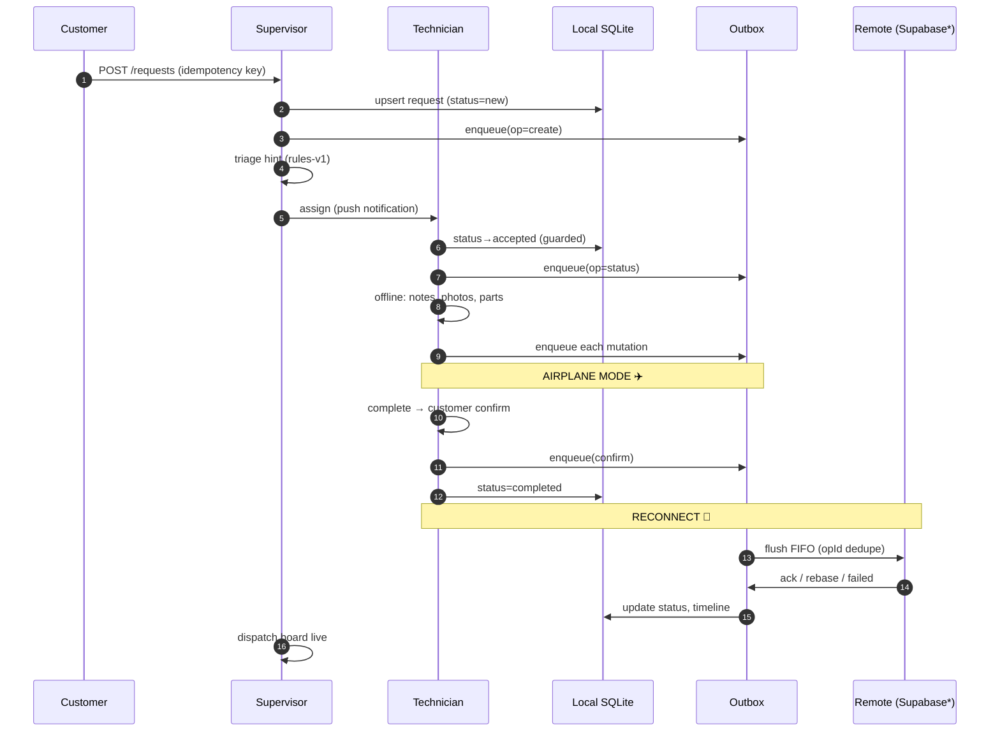
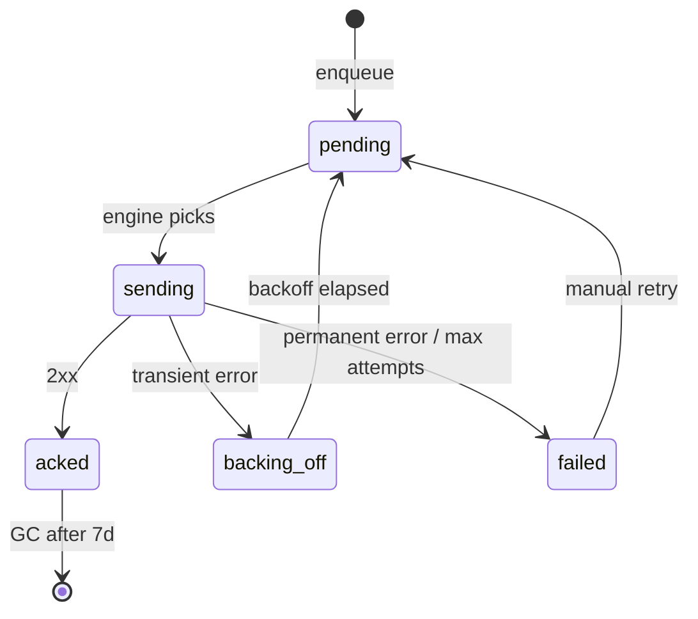

# Sallahha FieldOps — Architecture Diagram

```mermaid
%%{init: {'theme': 'base', 'themeVariables': { 'primaryColor': '#0E7C7B', 'edgeLabelBackground': '#f0f0f0' }}}%%
flowchart TB
    subgraph MOBILE[Mobile App (Flutter/Dart)]
        direction TB
        UI[UI Layer\nRiverpod + go_router\nRTL/AR-EN + Semantics]
        DOM[Domain Layer (pure Dart)\nStatus Machine\nSLA/Overdue\nTriage rules-v1]
        REP[Repository Interfaces\nRequest/Auth/Sync]
    end

    subgraph LOCAL[Local Persistence (Drift/SQLite)]
        DB[(SQLite: 16 tables\nservice_requests\nsync_operations\nusers, parts, ...)]
        CACHE[Cached Catalogs\nservices, parts\nnotifications]
        OUTBOX[Outbox\nSyncOperation rows\nopId = idempotency key]
    end

    subgraph SYNC[Sync Engine]
        ENGINE[SyncEngine\nper-entity FIFO\nexp backoff 1s→5min\nmax 25 attempts]
        CONFLICT[Conflict Policy\nstatus: server-wins\nnotes: LWW+history\nassignment/estimate: reject-and-flag]
    end

    subgraph SERVICES[External Services (interfaces)]
        MAP[Maps\nflutter_map/OSM + mock]
        NOTIF[Notifications\nlocal inbox + FCM*]
        PAY[Payments\nMock + Paymob*]
        ANALYTICS[Analytics\nlocal + FA*]
        AI[AI\nRuleBasedTriageService + ML*]
    end

    subgraph REMOTE[Optional Remote (Phase 5+)]
        SUPABASE[Supabase\nPostgres + RLS\nRealtime*]
    end

    UI --> DOM
    DOM --> REP
    REP --> LOCAL
    LOCAL --> DB
    LOCAL --> CACHE
    LOCAL --> OUTBOX
    OUTBOX --> ENGINE
    ENGINE --> CONFLICT
    ENGINE -.->|when online| SUPABASE
    UI --> MAP
    UI --> NOTIF
    UI --> PAY
    UI --> ANALYTICS
    UI --> AI
    REP -.->|Supabase adapter| SUPABASE
    ENGINE -.->|flush| NOTIF
    ENGINE -.->|flush| PAY
    ENGINE -.->|flush| ANALYTICS

    classDef mobile fill:#0E7C7B,color:#fff,stroke:#0E7C7B;
    classDef local fill:#15803D,color:#fff,stroke:#15803D;
    classDef sync fill:#B45309,color:#fff,stroke:#B45309;
    classDef svc fill:#1E40AF,color:#fff,stroke:#1E40AF;
    classDef opt fill:#6B7280,color:#fff,stroke:#6B7280;

    class UI,DOM,REP mobile;
    class DB,CACHE,OUTBOX local;
    class ENGINE,CONFLICT sync;
    class MAP,NOTIF,PAY,ANALYTICS,AI svc;
    class SUPABASE opt;
```

**Legend:** solid = compile-time dependency, dotted = runtime only when configured. `*` = optional adapter behind interface flag.

**Offline-first contract:** Reads always from SQLite cache. Mutations → local + durable outbox → flush on reconnect. Server never blocks the technician.

---

# Data Flow (Request Lifecycle)



---

# Offline Sync State Machine



**Conflict resolution:** status → server-wins; notes → LWW + history; assignment/estimate/parts → reject-and-flag. Never silent loss.

---

# Role Guard Map (UI-level; server enforces)

| Route | Customer | Technician | Supervisor | Admin |
|-------|----------|------------|------------|-------|
| /requests | ✅ (own) | ❌ | ✅ (all) | ✅ (all) |
| /requests/new | ✅ | ❌ | ❌ | ❌ |
| /requests/:id | ✅ (own) | ✅ (assigned) | ✅ | ✅ |
| /jobs | ❌ | ✅ (assigned) | ✅ | ✅ |
| /jobs/:id | ❌ | ✅ (assigned) | ✅ | ✅ |
| /dispatch | ❌ | ❌ | ✅ | ✅ |
| /reports | ❌ | ❌ | ✅ | ✅ |
| /notifications | ✅ | ✅ | ✅ | ✅ |

*Supervisor* = dispatcher; *Admin* = user management, seed data, audit.

---

# File Layout (Feature-first)

```
lib/
  app/                    # App shell, theme, localization bootstrap
  core/
    config/               # constants (governorates, env)
    di/                   # Riverpod providers (repo, services, sync)
    errors/               # AppError hierarchy + localized messages
    result/               # Result<T> = Ok|Err
    routing/              # go_router + role guards
    theme/                # tokens (teal/amber), M3 theme
    localization/         # ARB + labels helpers
    format/               # EGP, AR/EN dates
    storage/              # Drift DB, mappers, seed, local store
    sync/                 # OpLog, backoff, SyncEngine, Drift adapter
    analytics/            # AnalyticsService + memory impl
  features/
    auth/                 # login, mock auth, secure session
    requests/             # create, list, details, repo impl
    dispatch/             # queue tabs, assign, workload, triage hints
    jobs/                 # my jobs, execution (status, notes, photos, parts, estimate)
    notifications/        # inbox + repo hooks
    payments/             # mock gateway + collect UI
    reports/              # basic supervisor dashboard
    profile/              # locale + sign out
  shared/
    widgets/              # AppLoading/Empty/Error, OfflineBanner, SyncBadge, EntitySyncBadge
```

---

# Package Decision Log (Why)

| Package | Version | Why | Alternative Rejected |
|---------|---------|-----|---------------------|
| flutter_riverpod | 2.6.1 | Single state+DI, testable, less boilerplate than Bloc | Bloc (more files), GetX (test story) |
| go_router | 14.2.0 | Declarative, role redirects, standard in jobs | Navigator 1.0 (imperative) |
| drift | 2.24.0 | Real SQL, migrations, reactive streams, testable DAOs | Hive (KV), Isar (trajectory) |
| sqlite3_flutter_libs | 0.6.0+eol | Bundled sqlite on Android | System sqlite (version drift) |
| go_router | 14.2.0 | Declarative + role guards | AutoRoute (codegen weight) |
| image_picker | 1.0.8 | Camera + gallery, downscale params | Native intent (more code) |
| flutter_secure_storage | 9.2.2 | Keystore/Keychain, no SharedPrefs for tokens | shared_preferences (insecure) |
| connectivity_plus | 6.1.0 | Stream + explicit check | Manual ping (flaky) |
| flutter_localizations | sdk | ARB + gen-l10n | Manual maps (fragile) |
| intl | 0.20.2 | EGP/AR dates, number formats | Manual formatters (bug-prone) |
| flutter_map | 6.1.0 | OSM tiles, no key, mock fallback | google_maps_flutter (billing) |
| mocktail | 1.0.4 | Test fakes without codegen | mockito (codegen) |